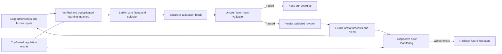

# Arata’s automatic feedback loop

Arata learns from the difference between its own pre-match forecasts and verified regulation-time outcomes. It does not use a prediction as a true result or optimize for the largest ticket payout. No key or paid learning service is required.

## Original records and usable labels

Every new Arata forecast saves its uncalibrated and starting-baseline probabilities, learning revision and schema-1 goal inputs. Inputs include goal baselines, overall/venue attack and defence rates, bounded form difference, H2H statistics and the already validated squad/xG multiplier available at that time. Their immutable snapshot lets a challenger replay the goal calculation without later team news, lineups or results leaking into its features.

Only Arata forecasts actually logged before kickoff are eligible. Model capture must also precede kickoff, be no more than 30 minutes older than capture, and not be marked stale or in-play. Finished regulation scores must be explicitly supplied by supported LiveScore, OpenLigaDB, BetPawa or attributed verified Flashscore/Elbotola result records. Owner-entered results, AET/penalty phases, future confirmation times, unsupported/refund markets and labels inconsistent with the score predicate are excluded. Confirmation time controls when a result becomes usable. Source/team aliases are canonicalized and recaptures contribute no extra votes. Conflicting supported source finals are excluded. One latest eligible forecasting frame per match is retained, with one snapshot per exact event; all markets for a match remain in the same time partition. At most the latest 2,000 qualifying matches within 730 days are used.

Old forecasts without frozen core inputs can support calibration of their recorded probabilities. They cannot train new core coefficients. They are also excluded from a challenger test when a changed core would require replaying missing inputs. These gaps remain visible as Core training matches in Model Lab.

## Trainable core weights

The core fits seven parameters with bounded, regularized coordinate optimization of regulation-goal Poisson negative log likelihood:

| Parameter | Starting value | Allowed range |
| --- | --- | --- |
| Venue share | 0.35 | 0–0.8 |
| Recent-form coefficient | 0.06 | 0–0.2 |
| H2H share | 0.05 | 0–0.15 |
| Attack exponent | 1 | 0.4–1.5 |
| Defence exponent | 1 | 0.4–1.5 |
| Home scoring scale | 1 | 0.7–1.3 |
| Away scoring scale | 1 | 0.7–1.3 |

Global and sufficiently covered league profiles can be learned. Goal rates remain bounded at 0.25–4.5. Sparse leagues use a validated global profile or the documented starting model. The history decay half-life and pseudomatch prior are not fitted by this release. Squad/rest/xG coefficients retain their independent historical validation, while their pre-match effect is frozen for core replay.

## Calibration of probability mistakes

For complete 1X2 probability vectors, the learner fits regularized multiclass temperature/power and outcome biases, normalizing home/draw/away back to one. Double chance and equivalent half-goal handicap events inherit those corrected probabilities.

Binary market families receive regularized sigmoid calibration with bounded features centered at 20%, 40%, 60% and 80%. These probability-range terms can correct different bias in different parts of the forecast range. A fitted curve that would reverse probability ordering falls back to a monotone sigmoid. Corrections abstain outside the fitted probability range (with a five-percentage-point margin); multiclass corrections similarly guard maximum-confidence coverage. Abstention at a support boundary can create a discontinuity, so this is not a globally monotone calibrated ranking across unsupported ranges. A covered league/market profile takes precedence over a general market profile. Totals lines pool within their own match/home/away family; different match/team markets are not combined. Exact joint selections remain distinct. Complementary events share a curve; equivalent clean-sheet/team-zero and win-to-nil events are joined. Joint result selections are normalized within the corrected winner marginal. These are marginal calibration rules, not a fully fitted joint score-distribution model.

Every family requires at least 40 distinct calibration matches and 30 validation matches. Binary fitting needs at least eight matches in each observed class; multiclass calibration requires all three outcomes. Rare markets and uncovered probability ranges cannot claim validated precision. A one-event-per-match range reliability chart shows issued forecasts, their pre-calibration values and observed frequency, with explicit sample counts. It is a diagnostic, not a profit projection.

## Chronology and activation

Initially, the earliest approximately 50% of matches form the core fitting/selection block, the next 25% the calibration block and the final 25% the activation holdout. Equal kickoff times never cross boundaries. Results not actually confirmed before the next block begins are removed from the earlier block. Core fitting uses the first 80% of its block, requiring at least 80 usable matches; its remaining later portion selects whether that core proposal warrants testing. The exact selected coefficients are retained, without refitting on later labels. Calibration is fitted after those core candidates are frozen, on a separate block.

Core proposals need a mean goal-loss gain greater than 0.01 and a positive conservative paired lower bound on the final later block. Calibrators require Brier gain >0.002 and log-loss gain >0.001 with positive paired lower bounds. The complete proposed workflow must also beat the actual issued forecasts on both metrics. Markets are averaged within each match before the workflow comparison, so heavily quoted matches do not become independent observations. All newly changed core scopes must pass; a failure rejects the candidate instead of swapping cores underneath already fitted calibration.

Bounds use mean paired improvement ±3.3 standard errors. These are deliberately conservative descriptive checks. Repeated monitoring, overlapping market families and model-selection effects mean they are not a formal guarantee of superiority. No higher confidence flag or profit claim follows merely from activation.

An evaluated holdout is consumed whether the candidate wins or loses. A subsequent attempt needs at least 30 newly settled matches with kickoff after the last evaluated window. Previously tested outcomes can then enter earlier training/calibration data; they cannot be reused as a fresh activation holdout. Rejected proposals keep the incumbent. Profiles expire after 90 days without a new validated update and the model returns to starting rules.

## Prospective monitoring and persistence

After 50 new verified matches actually forecast under an active revision, the learner compares its issued errors with the starting-baseline probabilities preserved at the time. A materially worse Brier score with a positive paired lower bound and worse log loss rolls back the whole update to the starting model. Its validation window is consumed before another attempt. Rollback changes future forecasts only.

The active registry and immutable decision record commit in one database transaction. Research refreshes pick up a changed revision and invalidate their forecast cache. The corrected Arata probabilities then reach value edges, ticket generation and the Arata/Bet Better blend. Bet Better remains an unmodified independent predictor. Forecast IDs distinguish feedback revisions/probabilities, and saved tickets retain their original model/price snapshot.

Settlement, research refresh and learning-report requests schedule checks, with single-job deduplication and a five-minute cadence. A persistent backend and incoming app requests are required; no machine-off scheduler is promised. Computation yields between bounded tasks while SQLite runs in its worker. Model Lab polls the report separately from live-score data.

## API and inspection

- `GET /api/models/learning`: current state, eligible/core match counts, rules, reliability bins, active coefficients/calibrators, drift checks and latest 50 decisions.
- `POST /api/models/learning/train`: queue a check and return HTTP 202; it never bypasses evidence or validation gates.
- Original forecast inputs/revision live with each prediction and its immutable model evidence. Decision audits remain stored in the `learning:audit:` namespace after the visible 50-run list rotates.

Technical references: [scikit-learn calibration](https://scikit-learn.org/1.8/modules/calibration.html) explains disjoint fitting/calibration data and reliability diagrams; [time-series validation](https://sklearn.org/stable/modules/cross_validation.html#time-series-split) explains evaluating on later observations. This app implements its own bounded JavaScript fitting routines; it does not depend on scikit-learn at runtime.
