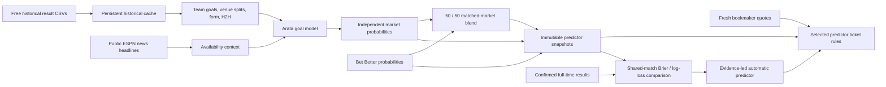

# Arata Model v3 · validated feedback learning

Arata owns the forecasting calculation and stores its forecasts separately from Bet Better. It still needs externally published football results and odds. This is a transparent statistical research model, not a trained language model and not a validated winning system.

## Data flow

Football-Data.co.uk provides three seasons of Premier League, Bundesliga, La Liga, Serie A and Ligue 1 results, plus its public USA/MLS archive. Only the preceding 730 days are considered. CSV result dates become usable after the entire UTC day, preventing same-day training leakage. All presentation and fixture-day filters remain in Africa/Kampala. The CSVs train the model; they do not overwrite official fixture scores or settle tickets.

Sources are downloaded sequentially within each league, with at most three requests per league. Request deduplication, shared in-flight requests, memory and persistent database caches are reused. Current-season histories refresh every six hours; completed-season files every seven days. A stale response is labelled and its forecasts are excluded from generated tickets. News refreshes every 30 minutes. Forecasts are recalculated at most every 15 minutes unless the quoted market set changes. Fixture and price refreshes continue independently every minute.

## Calculation

Forecasts require at least 40 league results and eight results for each team. Each team contributes at most its latest 40 matches. If either team's latest history is over 90 days old, Arata abstains. Only confirmed finished results available before the forecast time and kickoff can enter the calculation. Canonical names and team/date/league deduplication prevent alias records from inflating training.

Goals are weighted with a 120-day half-life. Six league-average pseudomatches shrink sparse team rates. Attack and concession rates mix overall form (65%) and the corresponding home/away venue split (35%). Expected home goals use the league home scoring baseline multiplied by home attack and away concession ratios; away goals use the equivalent away baseline. Recent five-match goal-difference form makes a bounded adjustment. At least three historical meetings are required for H2H to contribute; its weight is limited to 5%. Goal rates are bounded between 0.25 and 4.5.

Independent Poisson goal distributions generate a normalized score matrix from 0 to 18 goals per side. Home win, draw, away win, BTTS, double chance, half-goal totals and half-goal Asian handicap probabilities are summed from this matrix. Arata's three 1X2 probabilities sum to 100%. Alternative markets are created only for exact, quoted full-time lines. Integer and quarter lines remain excluded from ticket forecasts because refunds require separate settlement logic.

This implementation is inspired by goal-based football modelling. It **does not implement a fitted Dixon–Coles dependence correction**, optimize coefficients by maximum likelihood or claim calibrated parameters. The weights and priors above describe the starting model. Version 3 can retrain venue/form/H2H weights, attack/defence exponents and goal scales from its own frozen pre-match inputs and verified outcomes. The decay half-life and pseudomatch prior remain fixed; learned replacements require later-match validation. See [LEARNING.md](LEARNING.md). A Poisson model does not capture every dependency or tactical factor.

## Squad, availability, event xG and learned adjustments

The automatic research pipeline uses public ESPN team directories, published rosters, current/previous-season schedules and match summaries. A complete set of eleven distinct `starter: true` players is retained for confirmed historical full-time matches. A pre-match XI is described as **provider confirmed**, rather than club verified, only when the feed identifies the match as pre-match, the correct teams/time match, and kickoff is within two hours. Near kickoff the source cache is one minute. Predicted, incomplete and duplicate XIs never become confirmed. A finished source result earlier than kickoff plus three hours is rejected as inconsistent. Regulation FT is required; AET/penalty finals are not training results.

Official MLS reports are discovered from the league's media-resources page, with publication/update times, matchday bounds and team/player lists retained. Injuries, suspension, illness and international duty are distinguished. The official Premier League FPL feed supplies published player availability reports; injured/suspended players with zero next-round availability are treated as OUT. These are reports, not a complete medical registry. Questionable/doubtful players do not cause an automatic absence correction. Reports outside their date window or stale at forecast time cannot cause an adjustment. Linked ESPN team news remains contextual, with source/publication provenance; headlines alone cannot change the model. Unlisted players are **unknown**, never certified fit. Other leagues currently lack a connected comprehensive official absence report.

For each team, up to 40 historical confirmed XIs are used to fit ridge-regularized associations between starting players/rest and log goal-rate residuals after the goals, venue, form and H2H baseline. Actual regulation goals supply the current target. Player IDs are namespaced by provider. Player features require at least six starts and six non-starts in the training block; constant starters are not identifiable and receive no fabricated coefficient. Rest is a bounded feature derived from previous recorded league matches, not a complete travel/fitness calendar. It is applied only within two days of kickoff; longer-range forecasts withhold it. At least 32 XIs are required. The last quarter, with at least eight matches, is held out chronologically. An adjustment is enabled only if its residual MSE improves by at least 5% on that later block. The fit then uses all eligible historical rows. Coefficients are shrunk (ridge penalty 15), individual coefficients/log effects capped at 0.2, and the complete combined goal-rate correction at 0.3. Team fits older than 180 days are not applied. These are associations and retrospective checks, not causal medical estimates or proof of future superiority.

Confirmed XIs, when available, are compared with the historical starting frequencies. Without an XI, only an officially reported OUT player with an identified coefficient can change the forecast; the replacement is treated as team average. An OUT report conflicting with a confirmed XI withholds the correction. Source gaps, insufficient variation and failed holdout checks leave the correction inactive. Model Evidence shows sample sizes, held-out error changes, fitted coefficients and applied effects separately.

Licensed **StatsBomb Open Data** supplies full regulation shot events and starting XIs for the available archival seasons. Each shot retains player identity, minute, period, xG and outcome. Shootout and extra-time shots are excluded. Missing/non-finite xG invalidates the shot coverage. The dedicated archive API/chart exposes the original source and provider attribution logo. Archive match times are date-only approximations; they are never displayed as a current schedule or verified lineup. The open repository has narrower, older coverage than a paid feed. Its historical events are not presented as current squad or injury reports.

The event-xG layer estimates opponent-adjusted residual rates from preceding measured events, with shrinkage and at least eight matches per team. It tries weights 0/15/30/50% on earlier matches, then checks goal likelihood on a separate later block (at least 60 total eligible fixtures; required likelihood gain >0.02). Older events beyond 180 days cannot influence a current forecast, even if archival fitting passed. In the present free-data coverage, current xG adjustments may remain inactive. ESPN's selected player xG leaders are **not** complete team totals and are never substituted. No invented xG proxy fills missing events.

FotMob automatic collection is disabled because the publisher explicitly prohibits systematic automated use. No signed/private routes, challenge bypasses or API keys are used. Previously inspected source data is not used by the active v4 research context.

Research runs in two background league jobs, each with two bounded requests at a time, so fixture/live handling continues. Structured fields, not raw HTML/event payloads, are cached through in-flight, memory and persistent storage layers. Historical summaries cache for 30 days; licensed event records 90 days; rosters/schedules one hour; official reports 30 minutes. A six-hour research context avoids retraining at each price update, and progress/errors are visible through `/api/models/jobs`. Jobs restart from persistent source caches. Forecasts cache for 15 minutes, or one minute near kickoff, and are invalidated when research/availability/quote-market coverage changes.

Arata and the blend remain provisional, medium confidence. Strict Cautious qualification excludes them; clearly labelled review drafts remain available. validation of a component does not upgrade the entire predictor to high confidence. Prospective Model Lab comparison remains the test of prediction precision.

## Cooperation with Bet Better

Predictor modes: Arata Model, Bet Better, Arata + Bet Better, and Automatic. The blend averages probabilities 50/50 only for identical markets, selections, full-time periods and lines. It does not fill missing external estimates. Each generated ticket uses one identified predictor. Explicit selections remain unchanged; Automatic can fall back to another covered predictor when current prices cannot support its preferred model. The UI preserves predictor provenance, and saved legs lock their source, model version, price and available evidence.

Prediction snapshots are append-only. Source evidence is stored once by its SHA-256 content reference in the persistent `model-evidence:` namespace. Each Arata/blend snapshot retains an evidence ID and coverage summary; `/api/models/evidence` retrieves the exact original form, H2H and news context without a fresh web request. Existing provider snapshots are read as Bet Better records when a predictor field is absent. Own forecasts are not backfilled for past games. Comparisons therefore accumulate prospectively as logged fixtures finish.

## Fair evaluation and automatic choice

For each predictor and exact market, evaluation takes the latest fresh snapshot actually recorded before kickoff. A forecast must have been computed/fetched within 30 minutes of capture. Price refresh duplicates contribute no extra weight. Only fixtures with settled predictions from all three predictors are paired. One shared full-time market per match is chosen by a deterministic lexical rule, independent of the final score, and canonical fixture identity prevents duplicate source aliases from adding votes.

For binary event probability p and settled event y (1 for won, 0 for lost):

- Brier error = `(p − y)²`.
- Log loss = `−[y log(p) + (1 − y) log(1 − p)]`.
- Classification accuracy compares `p ≥ 0.5` with the observed event.

Lower Brier error and log loss are better. The chart shows rolling error across up to 20 paired matches. Model Lab exposes every included match, event, probability, capture time, version, outcome and error; the API supplies the complete records. These are binary-event metrics, not a full three-outcome Brier score or ticket ROI.

Automatic starts with Bet Better. At least 50 shared settled fixtures are required. The predictor with lowest mean Brier error must also have a positive approximate 95% paired error-difference interval against **each** alternative: mean difference ± 1.96 × standard error. Otherwise Automatic retains the baseline. This is a descriptive evidence threshold, not a guarantee; sequential checking, selection effects and shared model inputs can affect inference. Results apply only to the shared covered matches and markets. Bet Better's published pick selection can bias that comparison universe. No claim of universal league superiority is made.

Arata algorithm versions are separated by the current version filter. Changes to model weights must increment ARATA_VERSION. Provider update timestamps remain in the record. Automatic choices do not alter already saved tickets. No model has established superior precision yet; the chart intentionally starts empty.

## Sources

- [Football-Data free historical CSVs](https://www.football-data.co.uk/downloadm.php).
- [USA/MLS archive and notes](https://www.football-data.co.uk/usa.php).
- [Dixon and Coles football goal modelling paper record](https://www.research.lancs.ac.uk/portal/en/publications/modelling-association-football-scores-and-inefficiencies-in-the-football-betting-market%28d16276a2-d6e0-483b-a708-1d29663f1992%29.html).
- [ESPN football news](https://www.espn.com/soccer/).

The public CSV download interface is used, not the publisher's separate paid API. No sports API credential is required. Coverage and source availability may change.

Additional primary sources:

- [ESPN published team and match information](https://www.espn.com/soccer/).
- [MLS official player availability](https://www.mlssoccer.com/league-reports/player-availability-report/).
- [MLS current media/status reports](https://www.mlssoccer.com/media-resources/).
- [Premier League official injury news](https://www.premierleague.com/en/latest-player-injuries).
- [StatsBomb Open Data, documentation and licence](https://github.com/hudl/open-data).

Personal research use only. StatsBomb source attribution and its supplied logo accompany event charts. Open-data archives are downloaded on demand and are not redistributed inside the source package.

Unchanged quote recaptures update the current quote freshness without creating duplicate prediction records. Public odds snapshots append on a changed price/market set; the previous records are preserved. Saved ticket legs retain both the prediction snapshot capture and the current quote capture. Fresh-price checks still require the exact market, bookmaker and decimal price. This bounds log growth without erasing history.

## Expanded full-time markets (v2.2)

Probability and settlement share an exact regulation-time score predicate. Team totals and clean sheets use the corresponding marginal of the score matrix; odd/even includes zero as even. Result+totals and result+BTTS use joint score cells directly, rather than multiplying correlated same-game probabilities. Additional markets retain the existing cautious/balanced/extended probability floors, value requirement, fresh-price checks, one-pick-per-fixture and shared-team exclusions. Prices alone do not become forecasts, and pre-match predictions do not become live win probabilities.

## Validated feedback learning (v3)

The automatic learner now uses Arata’s own settled forecast errors to retrain the core goal calculation and fit probability corrections. Frozen sufficient statistics, the raw/baseline probability and feedback revision accompany every new forecast. Historical records without those original statistics may train calibration but never reconstruct core inputs from knowledge gathered after kickoff. Updates run in the background at most every five minutes while settlement/research/report requests are active. A persistent Node process remains necessary; this is not an off-app scheduler.

Learning has its own evidence gates, distinct from the 50-match external predictor comparison. It needs at least 200 distinct verified matches overall, separate earlier fitting/calibration blocks and at least 30 new later validation matches. Sparse scopes abstain. Validated revisions feed the next research refresh, invalidate cached forecasts and affect the Arata side of the blend. Original predictions and saved ticket prices are never rewritten. Model Lab exposes learning counts, range reliability, active weights, corrections and decisions. [LEARNING.md](LEARNING.md) specifies the fitting, validation, rollback and coverage rules.
